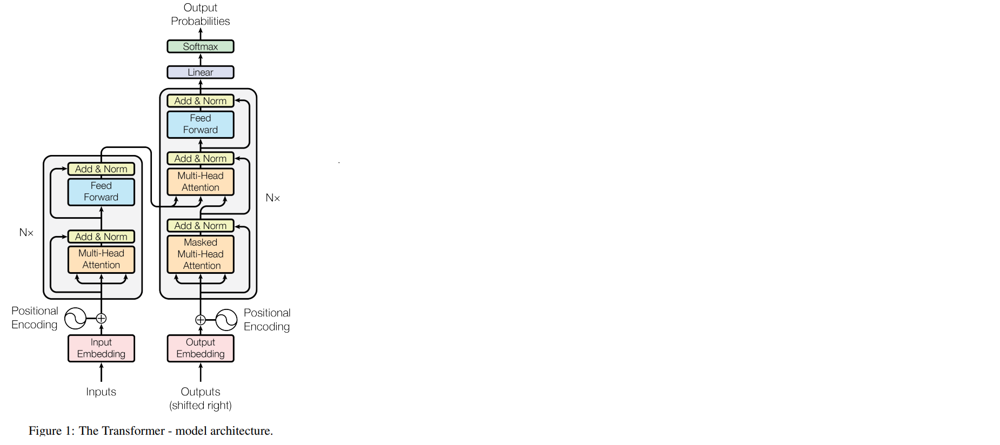

# Low Resource Machine Translation  

[](https://www.python.org/)  
[](https://jupyter.org/)

This repository contains the code for the project **Low Resource Machine Translation** for the course **CS779: Statistical Natural Language Processing** at **IIT Kanpur**.

---

## 🚀 Overview  

This project implements the **Transformer** architecture from scratch for **translating Indian languages to English** in a low-resource setting.  

---

## 📜 Transformer Architecture  

Below is the architecture of the Transformer model from the original paper:  



---

## 📂 Project Structure  
├── Low_resource_MT.ipynb # Implementation of Transformer from scratch

├── README.md # Project documentation


---


---

## 📥 Dataset  

- The training and test datasets can be accessed from the following link: 
  [Dataset Link](https://drive.google.com/drive/folders/12gyDCjh7A5HyhKBLD_ZzfXnsMN58gP7m?usp=sharing)


- **Important:** Once downloaded, update the dataset paths in `Low_resource_MT.ipynb` to point to the correct local paths before running.

---

## 🏃 How to Run  

1. **Clone this repository:**
   ```bash
   git clone https://github.com/Vaibhavmulti/Low_resource_MT.git
   cd Low_resource_MT

2. **Open the notebook**:

Using Jupyter Notebook:
```bash
jupyter notebook Low_resource_MT.ipynb
```
Or upload to Google Colab

## Results on test set

| Metric        | Score |
| ------------- | ----- |
| ROUGE Score   | 0.246 |
| charF++ Score | 0.293 |

3rd rank out of 26 students in the class.


